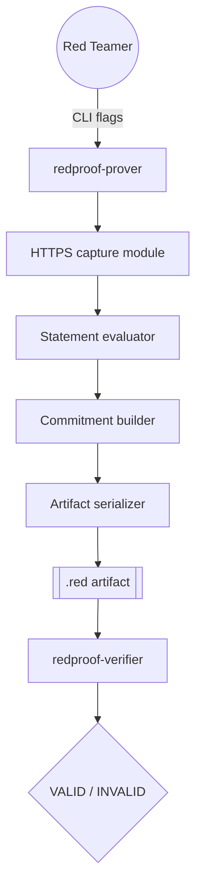
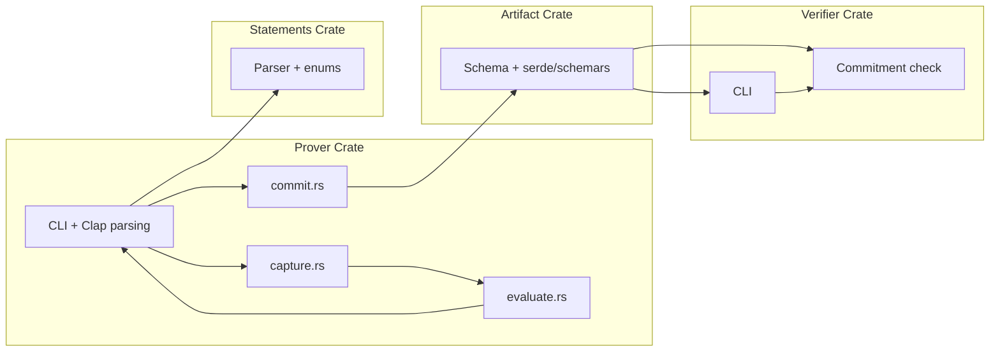
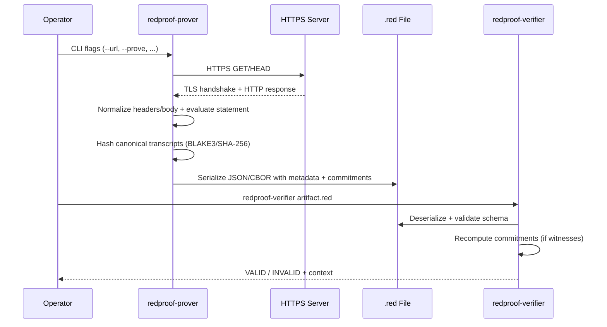

# RedProof Architecture

This document explains how the system fits together, what each crate is responsible for, and how data flows from a live HTTPS response to a `.red` artifact and finally to a verification result.

## 1. High-Level Flow

**Narrative**
1. The operator calls `redproof-prover`, specifying the target URL and the statement to prove (e.g., `header:absent:Strict-Transport-Security`).
2. The capture module performs a fresh HTTPS GET/HEAD, records TLS context, headers, and (optionally truncated) body.
3. The evaluation module checks whether the statement holds on that normalized response.
4. The commitment module hashes the canonical handshake/app-data blobs with the selected algorithm (BLAKE3 or SHA-256) and optionally stores witness data.
5. The artifact writer serializes everything into JSON or CBOR, producing a `.red` file.
6. The verifier re-loads the artifact, recomputes commitments (when witnesses are present), and prints a verdict.

## 2. Component Ownership

- `prover/src/capture.rs`: Handles networking, TLS metadata, body truncation, canonicalization.
- `prover/src/evaluate.rs`: Understands the statement language and computes a boolean result.
- `prover/src/commit.rs`: Emits hash commitments plus witness blobs.
- `redproof-artifact`: Owns the schema, JSON Schema generation, validation helpers.
- `redproof-statements`: Owns the statement AST and parser.
- `redproof-verifier`: Loads artifacts, validates schema, recomputes commitments, prints verdicts.

## 3. Data Lifecycle

## 4. Key Design Choices Explained
- **Canonicalization first, hashing later:** We serialize TLS metadata and response slices into canonical JSON before hashing so commitments remain stable across platforms.
- **Witness-friendly phase:** Until ZK proofs land (Phase 3), we include witness blobs so the verifier can recompute the commitment hashes. The CLI prints a warning if witness data is missing.
- **Dual hash support:** BLAKE3 is the default (fast, modern). SHA-256 remains available for compatibility with teams that require FIPS-friendly algorithms.
- **Dry-run preview:** Every capture can be inspected via `--dry-run` before we generate artifacts, reducing accidental disclosure.
- **Friendly failure path:** The verifier now prints `INVALID: <reason>` instead of exiting with a stack trace when a commitment mismatch occurs.

## 5. File & Directory Cheat Sheet
- `docs/PHASES.md` – plain-English history of the project.
- `docs/phase-*/` – per-phase runbooks, design notes, UX expectations.
- `examples/phase-2/` – good + tampered artifacts for demos/regression testing.
- `prover/` – CLI + capture + evaluation + commitment modules.
- `verifier/` – CLI + artifact verification logic.
- `artifact/` – schema structs + JSON Schema generator.
- `statements/` – statement grammar, parser, and serde support.

Use this doc as the authoritative reference when explaining RedProof to new contributors or stakeholders.
